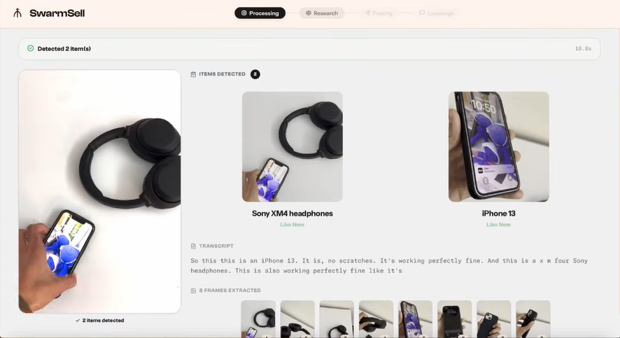

<div align="center">

# 🌀 SwarmSell: *Film your clutter. Watch AI sell it.*

[](LICENSE)
[](https://diamondhacks.acmucsd.com/)

</div>

---

## The Problem

Selling secondhand items is tedious. Cross-listing a single item across eBay, Facebook Marketplace, Mercari, and Depop can take 30–45 minutes — per item. Tools like Vendoo and Nifty automate some of it, but they work behind a spinner. You submit, you wait, you get a result. The process is invisible, the intelligence is hidden, and you're still babysitting it.

Nobody has built a tool that does this live, visibly, for multiple items at once — until now.

---

## What SwarmSell Does ✨

Record a short video of the items you want to sell. That's it.

SwarmSell analyzes your video *as it uploads*, identifies each item the moment it appears on screen, and launches a swarm of AI-controlled browser agents — one per platform, per item — all running simultaneously. You watch them work in a live grid: filling out forms, selecting categories, entering prices, submitting listings. Under two minutes later, your items are listed everywhere.

- 🎥 **Film once** — point your phone at a pile of stuff
- 🤖 **Agents spawn immediately** — before the upload even finishes
- 🪟 **Watch them work** — every browser window is live, real, and visible
- ✅ **Done** — listings submitted across 4+ platforms, automatically

> The swarm of real browsers doing real work isn't a feature — it's the product.

---

## Demo 🎬
Diamondhacks Submission video
* [Youtube SwarmSell Demo](https://www.youtube.com/watch?v=KWuWg4si-AU)



SwarmSell uses **Google Gemini** to analyze video frames in real time, **Browser-Use** to give AI agents natural language control over real browsers, and **Chrome DevTools Protocol (CDP)** to stream each browser's live screen back to the dashboard. What you see in the grid is not a simulation — every window is a real Chromium browser navigating a real website.

---

## Why This Matters

The resale market is massive — hundreds of millions of people sell secondhand goods every year. The bottleneck has never been demand. It's always been the friction of listing.

SwarmSell removes that friction entirely. More importantly, it changes *what* an AI product can feel like. Most AI tools are black boxes. You give them input and wait for output. SwarmSell makes the intelligence visible. Watching a swarm of agents negotiate real websites on your behalf is a fundamentally different experience — one that builds trust, demonstrates capability, and makes the value undeniable in real time.

---

## Try It Out 🚀

```bash
git clone https://github.com/adityasingh2400/SwarmSell && cd swarmsell
cp .env.example .env   # add your GEMINI_API_KEY
./start.sh
```

Open `http://localhost:3000`, drop a video, and watch the grid come alive.

---

## How We Built It 🛠️

### Streaming Pipeline

Most tools wait for a full video upload before doing anything. We don't. Using `ffmpeg` as a streaming pipe, we extract frames *as the video arrives* and send them to Gemini for analysis in real time. The first agent launches within seconds of upload start — before the video finishes uploading.

### AI Browser Agents

Each agent is powered by **Browser-Use**, an open-source library that gives LLMs control over real Chromium browsers using natural language. We pair this with structured playbooks — precise, step-by-step instructions per platform — so agents fill forms reliably instead of improvising. Natural language handles navigation and unexpected states; structured data handles the form fields.

### Live Browser Streaming

Every agent's browser screen is captured via **Chrome DevTools Protocol** (`Page.startScreencast`), which pushes JPEG frames as events — no polling. Those frames stream over a binary WebSocket to the frontend, where they appear live in the agent grid. What you see is exactly what the browser is doing.

### Resource Management

Running many browsers simultaneously on commodity hardware required careful engineering. All agents share a single Chromium process with isolated contexts, session cookies are injected per context (3× lighter than full profiles), and finished contexts are recycled for the next agent in queue.

### Platform Routing

After research agents gather pricing data, a local scoring algorithm selects the best platforms for each item — weighing expected sale value, data confidence, seller effort, and speed to sale. The top platforms get listing agents dispatched immediately.

### Tech Stack

| Layer | Technology |
|---|---|
| Audio Pipeline | Deepgram Nova-3 → Llama 4 Scout via Groq |
| Vision Pipeline | ffmpeg + OpenCV → Gemini Flash-Lite → Arctic-Embed-XS via Snowflake |
| Browser Automation | Browser-Use + Playwright |
| Agent LLM | ChatBrowserUse |
| Backend | FastAPI + asyncio |
| Frontend | React 19 + Framer Motion |

**Platforms:** eBay · Facebook Marketplace · Mercari · Depop · Amazon

---

## Challenges We Overcame 💪

**Streaming before the upload finishes.** Coordinating ffmpeg, Gemini's streaming API, and the agent scheduler in a way that doesn't block on any single step required careful async design. We rebuilt the pipeline several times before latency felt instant.

**Keeping agents reliable.** Naive LLM browser agents are inconsistent — they hallucinate steps, miss elements, and stall on unexpected UI states. Our hybrid approach (structured playbooks + natural language recovery) got completion rates high enough to demo confidently.

**Memory footprint.** Early versions tried to run separate browser processes per agent. It wasn't viable. Moving to shared Chromium contexts with injected session cookies cut memory usage dramatically and made the 12-browser live grid possible on a single machine.

---

## What We Learned 📚

Making AI *visible* changes how people feel about it. Every demo reaction we saw was the same: skepticism until the grid lit up, then immediate belief. The experience of watching agents work in real time is qualitatively different from receiving a result — it communicates competence in a way that no output alone can.

We also learned that streaming pipelines compound. Every optimization that reduced latency in one layer unlocked improvements in the next. The 3-second time-to-first-agent was only possible because every component — ffmpeg, Gemini, the scheduler, the frontend — was designed to start immediately and never wait.

---

## What's Next 🔭

- **Mobile upload** — submit directly from your phone camera roll
- **Expanded platforms** — Poshmark, Craigslist, OfferUp
- **Pricing intelligence** — historical sold data to suggest optimal list prices
- **Agent memory** — carry seller preferences, shipping templates, and category mappings across sessions
- **One-click relisting** — monitor sold status and automatically relist unsold items

---

<div align="center">

</div>
